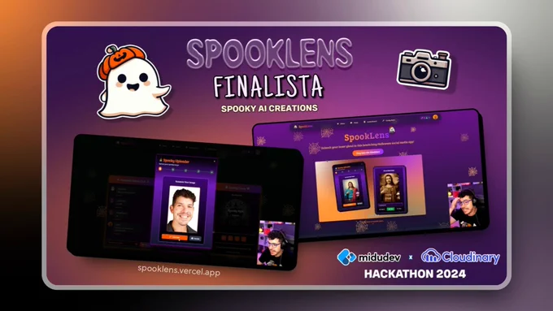
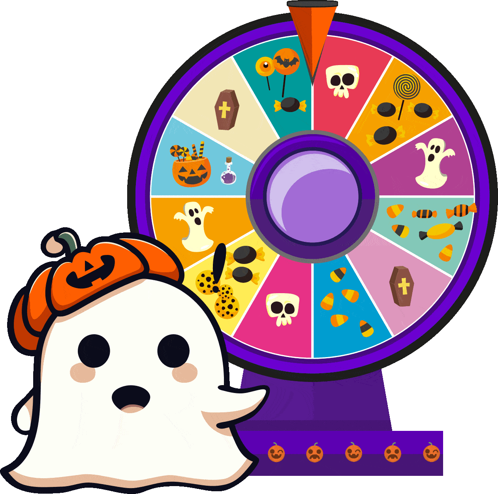

  
  <h1 align="center">🎃 SpookLens 👻</h1>
  

    <strong>🎉 Finalist Project in the Hackathon 2024 - Spooky AI Creations - MiduDev x Cloudinary 🌟</strong>
  

  

    
    
    
    
    
  

---

### 🎃 **SpookLens: A Halloween Social Experience**

**SpookLens** is a social media app crafted for Halloween lovers! 🎉 Showcase your costumes, interact with others, enjoy spooky tunes, compete, and earn rewards through fun and engaging features!

## 🌟 **Features**

### 🔮 Current Features

- **Trick or Treat**  
  Choose your path: 'Treat' for a chance to earn candies 🍬 or rare potions 🧪. Choose 'Trick' to apply haunting AI-powered effects to your photos using Cloudinary! 📸✨

- **Global Chat**  
  Join our cauldron of conversation with Halloween enthusiasts worldwide! 🌍🧙‍♀️

- **Haunted Music Player**  
  Set the mood with a chilling selection of Halloween tunes! 🎶

- **Candy Cauldron Leaderboard**  
  See who reigns supreme in our global rankings! Compete for the title of Halloween champion! 🏆

  

### 🕯️ Upcoming Features

- **Brew Magical Potions**  
  Use your candy to brew powerful potions that add supernatural effects to your photos or unlock special features. 🧙‍♂️🍵

- **Haunted Candy Store**  
  Spend your hard-earned candy on potions, spells, and exclusive prizes! 🎁

- **Private Chats**  
  Soon, you'll be able to have private one-on-one conversations with other spirits. 🔮👻

- **Evolve Your Inner Monster**  
  Unlock ranks and levels as you grow with SpookLens, bringing you closer to becoming the ultimate creature of the night! 🌙🧛‍♀️

- **Multilingual Support**  
  Currently supports English and Spanish, with Portuguese coming soon.

  

## 🛠️ **Technical Stack**

- **Frontend**: Built with [Next.js](https://nextjs.org/) for server-side rendering and static site generation. 🚀
- **Image Editing**: AI-powered image detection, editing and optimization via [Cloudinary](https://cloudinary.com/) for spooky transformations. 🖼️
- **Animations**: [Framer Motion](https://www.framer.com/docs/motion/) brings animations to life. 💫
- **UI**: Custom UI with [Tailwind CSS](https://tailwindcss.com/) and [ShadCN/UI](https://ui.shadcn.com). 🎨
- **Database**: [Firebase](https://firebase.google.com/) handles user data and interactions. 📦
- **Hosting**: Deployed on [Vercel](https://vercel.com/) for a seamless, scalable experience. 🌐

## 📱 **Responsive Design**

| Device          | Status         |
| --------------- | -------------- |
| PC - Big Screen | ✅             |
| Tablets         | 🚧 Coming Soon |
| Mobiles         | ☑️ In Progress |

## ©️ **Credits**

- Created by [Pavloh](https://x.com/impavloh) 👻
- Logos, animations, and variants were designed by me. 👻
- Avatars by [Freepik](https://www.freepik.com/).
- Music sourced from [Pixabay](https://www.pixabay.com).

## 📜 **License**

This project is licensed under the MIT License. See the [LICENSE](https://github.com/impavloh/spooklens/blob/main/LICENSE) for more details.

---

### 🚀 Project Submission for Hackathon 2024

The final project submitted for the Hackathon corresponds to this [commit](https://github.com/ImPavloh/spooklens/tree/f1720411db429c5b42dc7a3b4b0f097563089f3e). This commit marks the exact version of the project presented, which ended up being a finalist! 🎉

> **Note:**  
> I have many exciting ideas for the future of SpookLens! Stay tuned for more updates after the Hackathon.
